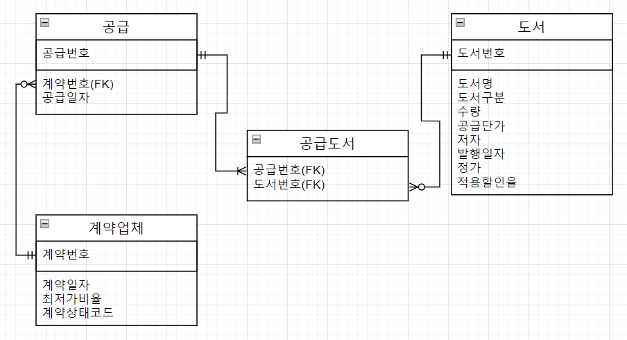
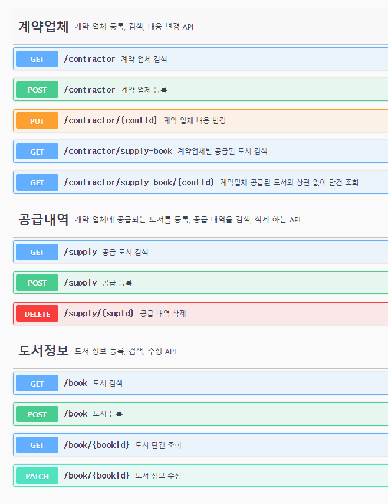

# Querydsl과 H2db를 활용한 Spring REST Api JUnit5 Test
<br/>

## 테스트 구조
* jpa 단위 테스트
```java
@DataJpaTest(showSql = false)
@ImportAutoConfiguration(DataSourceDecoratorAutoConfiguration.class)
@Import({P6spyLogMessageFormatConfig.class, QuerydslConfig.class})
public class RepositoryTestCommon {
	public static StopWatch stopWatch = new StopWatch();
}

@DisplayName("도서  Jpa 단위 테스트")
class BookInfoRepositoryTest extends RepositoryTestCommon {
...
}
```  
<br/>

* Service to Jpa 부분 통합 테스트
```java
@DataJpaTest(showSql = false)
@ImportAutoConfiguration(DataSourceDecoratorAutoConfiguration.class)
@Import({P6spyLogMessageFormatConfig.class, QuerydslConfig.class})
public class ServiceTestCommon {
	public static StopWatch stopWatch = new StopWatch();
}

@DisplayName("도서 Service to Jpa 테스트")
@Import(BookInfoService.class) // 테스트 시간을 최소화 하기 위해 @DataJpaTest로 의존하는 repo를 생성하고 테스트할 Service만 생성.
class BookInfoServiceTest extends ServiceTestCommon {
...
}
```
<br/>

* 전체 통합 테스트
```java
@SpringBootTest
@AutoConfigureMockMvc
@Transactional
public class ControllerTestCommon {
	public static StopWatch stopWatch = new StopWatch();
}

DisplayName("도서 통합 테스트")
class BookInfoControllerTest extends ControllerTestCommon {
...
}
```
<br/>

## ERD
</img>  

* 다대다 구조를 연관관계 테이블을 활용해 일대다, 다대일 구조로 풀어내고  
양방향 연관관계 저장, 조회 삭제를 jpa와 Querydsl로 구현했습니다.
<br/>

## 기능 정의
* 공통 사항 
  * 목록 조회는 페이징을 적용
* 도서 정보 등록, 검색, 수정 API
  * 도서구분 type이 일치하고 검색 keyword가 도서 제목 or 저자명에 포함 하는 필터링 검색 API
* 공급 도서 조회 API  
  * 공급 내역을 포함하여 공급된 도서 제목, 저자, 구분으로 필터링 검색 API
  * 공급 내역을 삭제하는 API
* 계약업체 등록, 검색, 내용 변경 API  
  * 계약업체별 공급된 도서를 계약상태코드, 도서 제목, 저자, 구분으로 필터링 검색 API
<br/>

## Swagger
</img>
